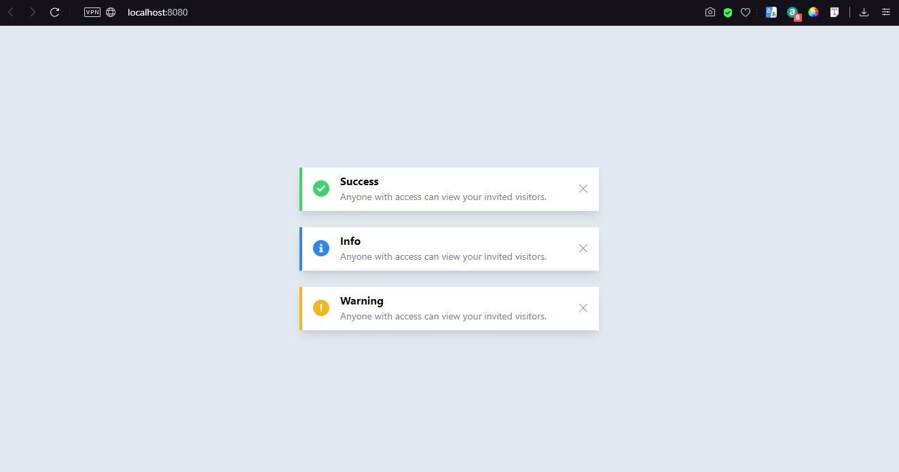
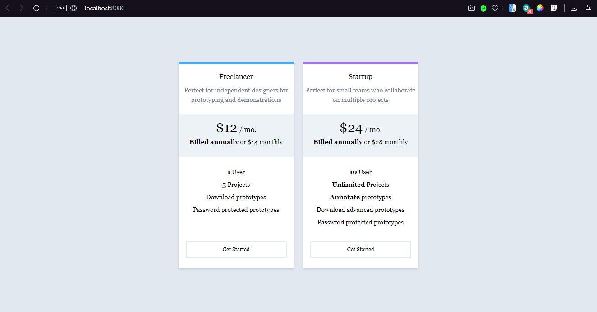
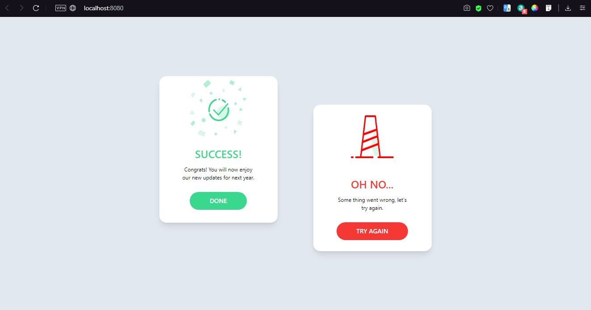
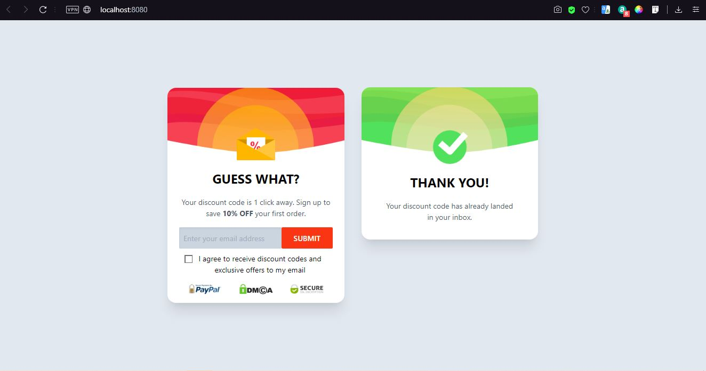
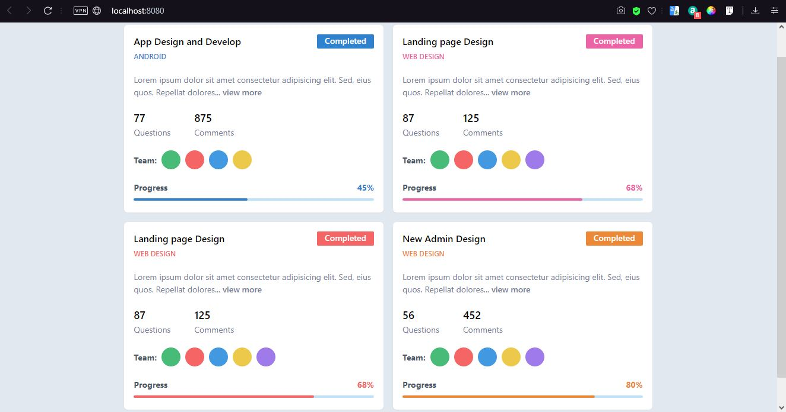
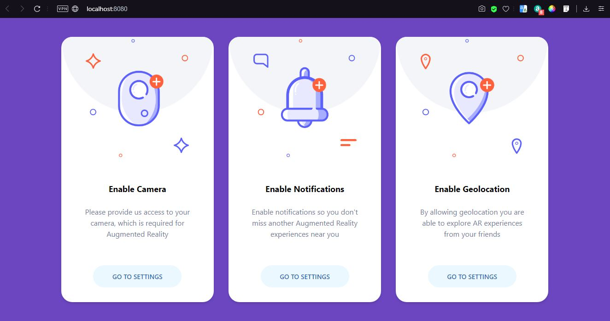

# Vue and Tailwindcss Experiments

This project created for experiments with Vue and Tailwindcss technologies

## Screenshots








## Inspiration

[Inspired by](https://www.pinterest.com/pin/591519732296784758/) - Flow Messages

[Inspired by](https://www.pinterest.com/pin/591519732296784926/) - Pricings

[Inspired by](https://www.pinterest.com/pin/591519732296785565/) - Card Flow Messages

[Inspired by](https://www.pinterest.com/pin/591519732296798114/) - Subscribe Cards

[Inspired by](https://www.pinterest.com/pin/591519732296798202/) - Project Cards

[Inspired by](https://www.pinterest.com/pin/591519732296798811/) - AR Permissions

## Project setup
```
npm install
```

### Compiles and hot-reloads for development
```
npm run serve
```

### Compiles and minifies for production
```
npm run build
```

### Lints and fixes files
```
npm run lint
```

### Customize configuration
See [Configuration Reference](https://cli.vuejs.org/config/).

## Author
> © Denis Ostrovsky
 
## License
[](https://github.com/DenisOstr/VueTailExp/blob/master/LICENSE)